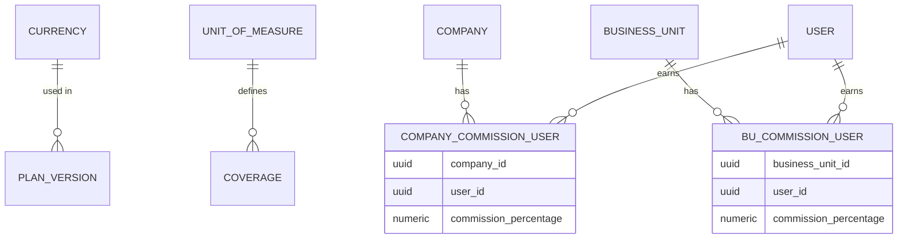

# Módulo de Finanzas

Este módulo centraliza la gestión de monedas, unidades de medida y la lógica de comisiones dinámicas del sistema.

## Modelos

### Currencies
Gestiona las monedas soportadas por el sistema.
- `id`: Entero (incremental)
- `code`: ISO de 3 caracteres (ej: USD, COP)
- `name`: Nombre descriptivo
- `symbol`: Símbolo (ej: $)

### Units of Measure
Define las unidades de medida para las coberturas de los planes.
- `id`: Entero (incremental, compatible con legacy)
- `name`: Objeto JSON con traducciones (i18n)
- `measure_type`: Tipo de dato (integer, decimal, none, text)
- `status`: Estado de la unidad

### Commissions
El sistema permite configurar porcentajes de comisión para distintos actores (usuarios) en dos niveles:
1. **Company Level**: Comisiones globales para una empresa.
2. **Business Unit Level**: Comisiones específicas para una oficina o agencia.

#### Lógica de Dispersión
La dispersión calcula montos absolutos basados en el `commission_percentage` (0-100) de cada actor configurado sobre el monto total de la venta.

## Endpoints

### Catálogos
- `GET /api/v1/finance/currencies`: Lista monedas activas.
- `GET /api/v1/finance/units-of-measure`: Lista unidades de medida activas.

### Comisiones
- `POST /api/v1/finance/commissions/calculate`: Calcula la dispersión de comisiones para un monto y entidad (Company/BU) específicos.

## Diagrama de Entidad-Relación

