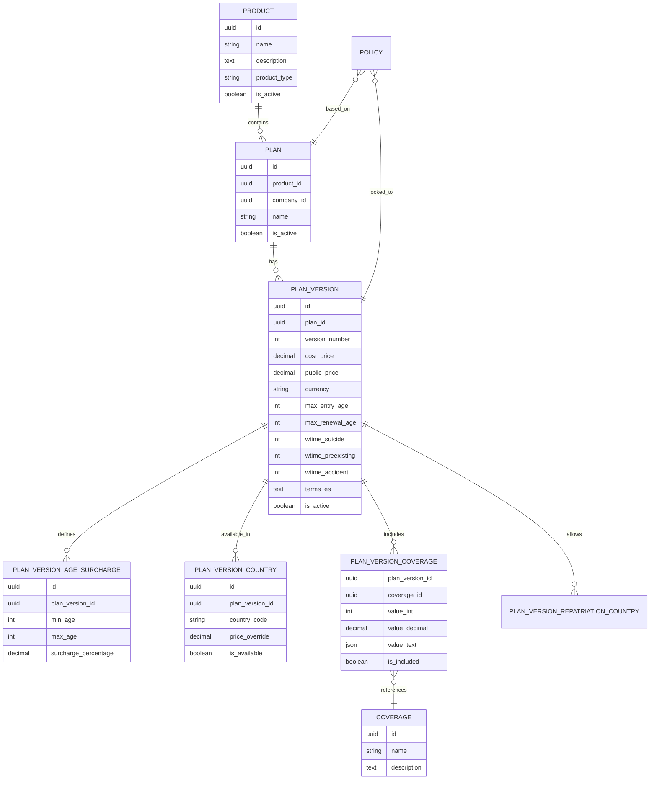

# 📦 Módulo de Productos y Planes

El módulo de productos gestiona la jerarquía comercial y técnica de los servicios ofrecidos por Yastubo. Ha sido rediseñado para soportar múltiples versiones, precios dinámicos por país y recargos por edad.

## 🏗️ Estructura Jerárquica

El sistema se divide en tres niveles principales:

1.  **Producto (Product):** La entidad raíz (ej. "Asistencia Funeraria"). Define el tipo de servicio.
2.  **Plan (Plan):** La versión comercial. Puede estar vinculado a una empresa específica (`company_id`) para planes corporativos.
3.  **Versión de Plan (PlanVersion):** La configuración técnica y financiera en un momento dado. Incluye precios, tiempos de carencia y reglas de elegibilidad.

## 📊 Diagrama de Entidad-Relación (ER)

## ⚙️ Reglas de Negocio

### 1. Versionado
Cada vez que se modifican las condiciones técnicas o de precio de un plan, se debe generar una nueva `PlanVersion`. Las pólizas emitidas quedan vinculadas permanentemente a la versión vigente en el momento de la emisión, asegurando la inmutabilidad del contrato.

### 2. Precios y Recargos
El precio final de un beneficiario se calcula siguiendo esta lógica:
1.  Se toma el `public_price` de la `PlanVersion`.
2.  Si existe un `price_override` para el país de residencia del cliente, se usa este en lugar del precio base.
3.  Se aplica el recargo por edad (`PlanVersionAgeSurcharge`) correspondiente al rango de edad del beneficiario.

### 3. Tiempos de Carencia (Vesting Periods)
Se definen tres tipos de tiempos de espera en días:
*   **Accidental (`wtime_accident`):** Días de espera para muertes accidentales (usualmente 0).
*   **Preexistencias (`wtime_preexisting`):** Días de espera para enfermedades preexistentes.
*   **Suicidio (`wtime_suicide`):** Días de espera para eventos de suicidio.

## 🚀 API Endpoints Principales

*   `GET /api/v1/products/`: Listar productos activos con sus planes y versiones.
*   `POST /api/v1/products/`: (Admin) Crear un producto con su estructura completa.
*   `POST /api/v1/plans/calculate-price`: Calcular el precio exacto para un beneficiario basado en su edad y país.
